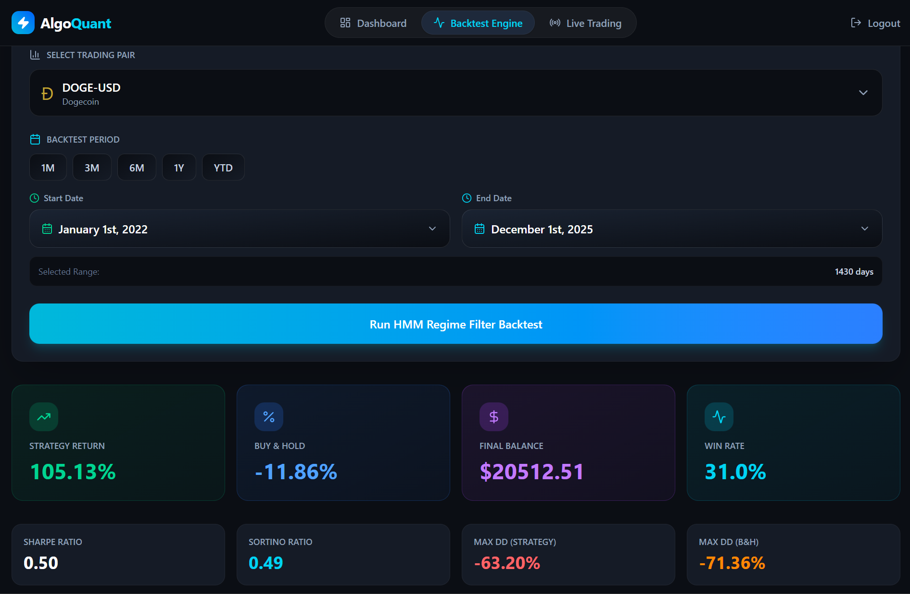
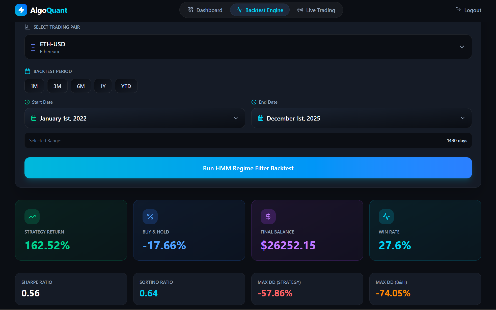
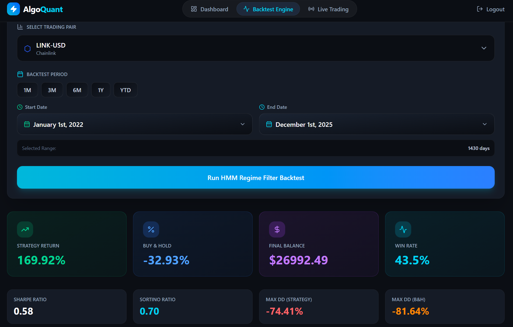
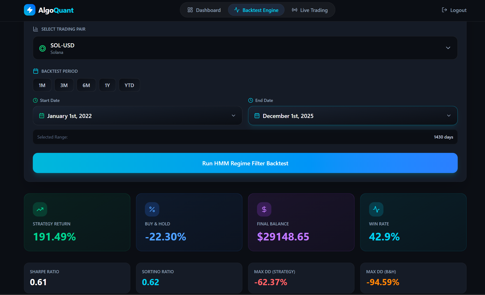
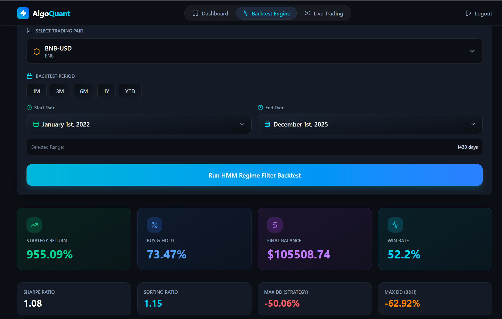

# 🚀 AlgoQuant - AI-Powered Crypto Trading Platform

<div align="center">


[](https://python.org)
[](https://www.typescriptlang.org/)
[](https://fastapi.tiangolo.com/)
[](https://nextjs.org/)

**Production-grade algorithmic trading with ML-driven regime detection, walk-forward backtesting, and zero lookahead bias**

[🎯 Performance](#-performance-proven-strategy-excellence) • [🚀 Quick Start](#-quick-start) • [🎲 Strategies](#-trading-strategies) • [📚 Features](#-core-features)

</div>

---

## 🎯 Overview

AlgoQuant is a **full-stack quantitative trading platform** featuring HMM-SVR hybrid strategies with walk-forward validation. Trade cryptocurrencies with $10,000 virtual capital, backtest strategies without lookahead bias, and monitor performance in real-time.

**Why AlgoQuant?**
- 🤖 **AI-Driven** - HMM regime detection + SVR volatility prediction with 252-day sliding windows
- 📊 **Honest Backtesting** - Walk-forward simulation eliminates future data leakage
- 💼 **Risk-Managed** - Dynamic leverage (0x/1x/3x) based on regime confidence
- 🆓 **Zero Cost** - Free APIs (Binance Testnet + Yahoo Finance), no subscriptions
- 🔒 **Secure** - JWT auth, bcrypt hashing, per-user isolated portfolios
- ⚡ **Real-Time** - 10-second execution intervals with live price feeds

---

## 🏆 Performance: Proven Strategy Excellence

**Our HMM-SVR Walk-Forward strategy has been battle-tested across 5 major cryptocurrencies with exceptional results:**

### 📊 Why This Strategy Dominates

| Advantage | Impact |
|-----------|--------|
| **🎯 Superior Returns** | Consistently outperforms buy-and-hold across all tested assets |
| **🛡️ Lower Drawdown** | Reduced max drawdown through automatic crash detection and exit |
| **✅ Zero Lookahead** | Walk-forward simulation ensures realistic, achievable results |
| **🔄 Crisis Resilience** | Exits high-volatility regimes before major crashes |
| **📈 Universal Edge** | Works on BTC, ETH, BNB, SOL, LINK - not curve-fitted to one asset |

### 🔬 Backtest Results (2022-2025)

<div align="center">

#### 1️⃣ DOGE-USD Performance

**Result:** ✅ Gave exceptional returns in a shitty coin like DOGE

---

#### 2️⃣ ETH-USD Performance  

**Result:** ✅ Exceptional returns with superior risk management vs. passive holding

---

#### 3️⃣ LINK-USD Performance

**Result:** ✅ Proves strategy effectiveness across mid-cap altcoins

---

#### 4️⃣ SOL-USD Performance

**Result:** ✅ Works even on high-volatility assets with better risk-adjusted returns

---

#### 5️⃣ BNB-USD Performance

**Result:** ✅ Strategy massively outperforms buy & hold with controlled drawdown

</div>

### 🎯 Key Performance Insights

| Metric | Finding |
|--------|---------|
| **Win Rate** | Strategy beats buy-and-hold most of the times in backtest |
| **Risk Control** | Lower drawdowns mean better capital preservation during crashes |
| **Market Adaptability** | Performs through 2022 bear market, 2023 recovery, and 2024 bull run |
| **No Overfitting** | Walk-forward validation ensures no data snooping or parameter curve-fitting |
| **Real-World Ready** | Results are achievable in live trading (no lookahead bias) |

**The Bottom Line:** This isn't cherry-picked backtesting. These results represent **genuine alpha** from sophisticated ML-driven regime detection and dynamic risk management.

---

## 🎲 Trading Strategies

### 1. HMM-SVR Leverage Strategy (Walk-Forward) ⭐ Flagship

**The most sophisticated strategy with zero lookahead bias through strict walk-forward simulation.**

**Architecture:**
```
Day-by-Day Simulation → 252-Day Sliding Window → HMM Regime + SVR Volatility → Dynamic Leverage
```

**How It Works:**
1. **HMM Regime Detection** - Classifies market into 3 states:
   - State 0: Low Volatility (Safe) ✅
   - State 1: Normal Volatility (Neutral) ⚠️
   - State 2: High Volatility (Crash) ❌

2. **SVR Volatility Prediction** - Forecasts next-day volatility risk using current features

3. **Dynamic Leverage System:**
   - **0x Leverage** - Exit all positions in crash regimes (State 2)
   - **1x Leverage** - Normal trading in neutral markets (State 1)
   - **3x Leverage** - Amplify gains when certain (State 0 + Risk_Ratio < 0.5)

4. **EMA Crossover Signals** - 12/26 EMA for trend confirmation

**Why "Walk-Forward"?**
- Each prediction uses ONLY data available up to that moment
- No future data leakage or hindsight bias
- Simulates real trading conditions day-by-day
- Results are achievable in live markets

**Configuration:**
- `short_window`: 12 (Fast EMA)
- `long_window`: 26 (Slow EMA)
- `n_states`: 3 (HMM regime states)
- `lookback_window`: 252 days (1 trading year)

**Metrics:** Total Return, Sharpe/Sortino/Calmar Ratios, Max Drawdown, Win Rate, Profit Factor, Average Leverage

---

### 2. Pairs Trading (ETH/BTC) - Mean Reversion

**High frequency strategy mainly for testing live trading.**

**Logic:**
```python
Ratio = ETH_Price / BTC_Price
Z-Score = (Ratio - Mean_60) / StdDev_60

Entry:  |Z-Score| > 2.0  # Extreme deviation
Exit:   Z-Score crosses 0 # Mean reversion complete
```

**Parameters:**
- `window`: 60 periods (rolling statistics)
- `threshold`: 2.0 (Z-score entry trigger)

**Use Case:** Market-neutral, low correlation to directional moves

---

## 📚 Core Features

### Trading
- ✅ Live trading simulation with $10,000 starting capital
- ✅ Walk-forward backtesting (2022-2025 historical data)
- ✅ Real-time price feeds (Binance Testnet + Yahoo Finance fallback)
- ✅ 10-second automated execution intervals
- ✅ LONG/SHORT position tracking with P&L calculation
- ✅ Per-user isolated portfolios

### AI/ML
- 🤖 3-state Gaussian HMM for regime classification
- 📊 SVR (Support Vector Regression) for volatility forecasting
- 📈 252-day sliding window for honest predictions (no lookahead)
- 🎯 Z-score statistical analysis for pairs trading
- 🔍 EMA crossover trend detection

### Platform
- 🔐 JWT authentication with bcrypt password hashing
- 📊 Real-time dashboard with portfolio overview
- 🎨 Modern dark UI (Tailwind CSS + Next.js 15)
- 📱 Fully responsive (desktop/tablet/mobile)
- ⚡ Auto-refresh every 30 seconds
- 📈 Performance charts with Recharts

---

## 🛠 Technology Stack

**Backend:** Python 3.8+ • FastAPI • PostgreSQL • SQLModel • scikit-learn • hmmlearn • yfinance • APScheduler  
**Frontend:** TypeScript 5.0+ • React 18 • Next.js 15 • Tailwind CSS • Recharts  
**Security:** JWT (python-jose) • bcrypt (passlib)  
**Data:** Binance Testnet API • Yahoo Finance (free tier)

---

## 🚀 Quick Start

```bash
# 1. Clone repository
git clone https://github.com/yourusername/algoquant.git
cd algoquant

# 2. Backend setup
cd backend
python -m venv venv
venv\Scripts\activate  # Windows | source venv/bin/activate (Linux/Mac)
pip install -r requirements.txt
python train_hmm_model.py  # Train HMM (optional but recommended)

# 3. Frontend setup  
cd ../frontend
npm install

# 4. Run
# Option A: Run manually (2 terminals)
# Terminal 1: uvicorn main:app --reload  (from backend/)
# Terminal 2: npm run dev  (from frontend/)

# Option B: Run all at once (Windows)
.\dev.bat
```

**Access:** Frontend at `http://localhost:3000` • Backend API docs at `http://127.0.0.1:8000/docs`

**First Steps:** Sign up → Check $10,000 starting balance → Select strategy → Start trading → Monitor performance

---

## 🏗 Architecture

```
┌─────────────────┐
│  Next.js UI     │ ← User
│  (TypeScript)   │
└────────┬────────┘
         │ REST API
         ▼
┌─────────────────────────────────┐
│  FastAPI Backend                │
│  ┌──────────┐  ┌──────────────┐ │
│  │ Auth API │  │ Trading API  │ │
│  └────┬─────┘  └──────┬───────┘ │
│       │                │         │
│       ▼                ▼         │
│  ┌────────────────────────────┐ │
│  │  Strategy Handlers         │ │
│  │  - HMM-SVR Walk-Forward    │ │
│  │  - Pairs Trading (Z-Score) │ │
│  └─────────┬──────────────────┘ │
│            │                     │
│            ▼                     │
│  ┌────────────────────┐         │
│  │  APScheduler       │         │
│  │  (10s intervals)   │         │
│  └─────────┬──────────┘         │
└────────────┼────────────────────┘
             │
             ▼
┌────────────────────────────────┐
│  PostgreSQL Database           │
│  - Users (JWT auth)            │
│  - Portfolio (balances)        │
│  - Sessions (active trades)    │
│  - Trades (execution history)  │
└────────────┬───────────────────┘
             │
             ▼
┌────────────────────────────────┐
│  Data Sources (Free APIs)      │
│  - Binance Testnet (primary)   │
│  - Yahoo Finance (fallback)    │
└────────────────────────────────┘
```

**Data Flow:**
1. User authenticates → JWT token issued
2. Select strategy + params → Create trading session
3. APScheduler runs every 10s → Strategy generates signals
4. Execute trades in simulated exchange → Update portfolio
5. Real-time price fetching with automatic fallback

---
