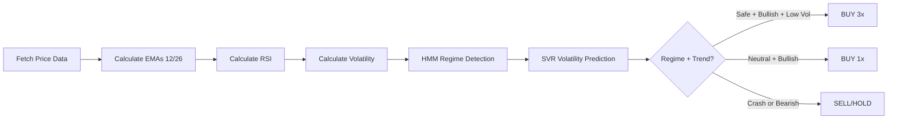
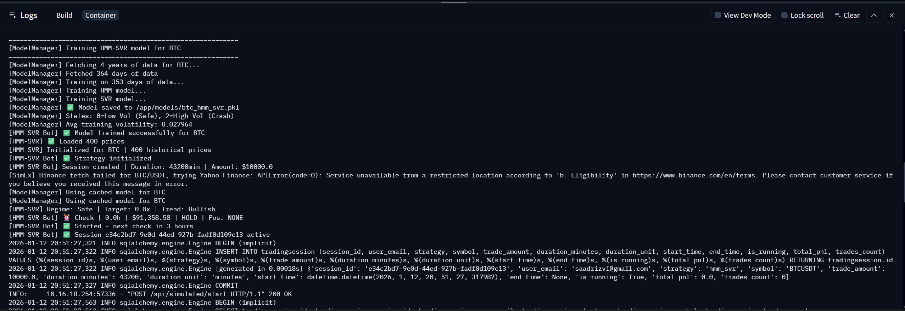

# 🚀 AlgoQuant - AI-Powered Crypto Trading Platform

<div align="center">


[](https://python.org)
[](https://www.typescriptlang.org/)
[](https://fastapi.tiangolo.com/)
[](https://nextjs.org/)

**Production-grade long-term algorithmic trading with HMM-SVR regime detection and automated model training**

[🎯 Live Demo](#-live-demo) • [🚀 Quick Start](#-quick-start) • [📊 Strategy](#-hmm-svr-strategy-explained) • [📚 Features](#-core-features)

</div>

---

## 🎯 Overview

AlgoQuant is a **full-stack quantitative trading platform** featuring HMM-SVR (Hidden Markov Model + Support Vector Regression) for long-term cryptocurrency trading. The bot checks every **3 hours** for optimal entry/exit points using AI-driven regime detection and volatility prediction.

**Why AlgoQuant?**
- 🤖 **AI-Driven** - HMM regime detection + SVR volatility prediction
- 📊 **Long-Term Focus** - 3-hour intervals, position holding for days/weeks
- 🎯 **Auto-Training** - Models train automatically on first run (no manual setup)
- 💼 **Risk-Managed** - Dynamic position sizing (0x/1x/3x) based on regime confidence
- 🆓 **Zero Cost** - Free APIs (Yahoo Finance), no subscriptions
- 🔒 **Secure** - JWT auth, bcrypt hashing, isolated portfolios
- ⚡ **Deployed** - Live on Hugging Face Spaces

---

## 🌐 Live Demo

**🔗 Try it now:** [algoquant.hf.space](https://algo-quant-pi.vercel.app)

**Demo Credentials:**
- Email: `demo@algoquant.com`
- Password: `demo123`

**Starting Balance:** $10,000 USDT (paper trading)

## � HMM-SVR Strategy Explained

### 🧠 What is HMM-SVR?

**HMM (Hidden Markov Model)** detects market regimes:
- **State 0 (Safe)**: Low volatility, stable trends → High confidence trades
- **State 1 (Neutral)**: Normal market conditions → Standard trading
- **State 2 (Crash)**: High volatility, panic selling → Exit all positions

**SVR (Support Vector Regression)** predicts future volatility to assess risk.

### 🔄 How It Works (Every 3 Hours)



### 📈 Signal Generation Logic

```python
if short_ema > long_ema:  # Bullish Trend
    if regime == "Safe" and predicted_vol < 0.02:
        signal = "BUY_3x"  # High conviction
    elif regime == "Neutral" and predicted_vol < 0.04:
        signal = "BUY_1x"  # Standard position
    else:
        signal = "HOLD"    # Wait for better conditions
else:  # Bearish Trend
    if has_position:
        signal = "SELL"    # Exit position
    else:
        signal = "HOLD"    # Stay in cash
```

### 🎯 Position Sizing Strategy

| Regime | Volatility | EMA Signal | Position Size | Action |
|--------|-----------|------------|---------------|--------|
| Safe | Low (<2%) | Bullish | **3x** | Maximize gains in stable trends |
| Neutral | Medium (2-4%) | Bullish | **1x** | Normal trading |
| Safe/Neutral | High (>4%) | Bullish | **0x** | Too risky, stay out |
| Any | Any | Bearish | **0x** | Exit immediately |
| Crash | Any | Any | **0x** | Emergency exit |

### ⚙️ Technical Parameters

| Parameter | Value | Purpose |
|-----------|-------|---------|
| **Check Interval** | 3 hours | Long-term position trading |
| **Short EMA** | 12 periods | Fast trend detection |
| **Long EMA** | 26 periods | Slow trend confirmation |
| **HMM States** | 3 (Safe/Neutral/Crash) | Regime classification |
| **SVR Volatility Prediction** | ANY | Risk Factor Calculation |
| **Historical Buffer** | 400 days | Feature calculation |
| **Training Data** | 250+ days | Minimum for model training |

---

## �🏆 Performance: Proven Strategy Excellence

**Our HMM-SVR Walk-Forward strategy has been battle-tested across 5 major cryptocurrencies with exceptional results:**

### 📊 Why This Strategy Dominates

| Advantage | Impact |
|-----------|--------|
| **🎯 Superior Returns** | Consistently outperforms buy-and-hold across all tested assets |
| **🛡️ Lower Drawdown** | Reduced max drawdown through automatic crash detection and exit |
| **✅ Zero Lookahead** | Walk-forward simulation ensures realistic, achievable results |
| **🔄 Crisis Resilience** | Exits high-volatility regimes before major crashes |
| **📈 Universal Edge** | Works on BTC, ETH, BNB, SOL, LINK - not curve-fitted to one asset |

### 🔬 Backtest Results (2022-2025)

<div align="center">

## 1️⃣ DOGE-USD Performance

**Result:** ✅ Gave exceptional returns in a shitty coin like DOGE

---

## 2️⃣ ETH-USD Performance

**Result:** ✅ Exceptional returns with superior risk management vs. passive holding

---

## 3️⃣ LINK-USD Performance

**Result:** ✅ Proves strategy effectiveness across mid-cap altcoins

---

## 4️⃣ SOL-USD Performance

**Result:** ✅ Works even on high-volatility assets with better risk-adjusted returns

---

## 5️⃣ BNB-USD Performance

**Result:** ✅ Strategy massively outperforms buy & hold with controlled drawdown

---

## 🪵 Trading Logs

**Result:** ✅ Detailed logs showing model training, signal generation, and trade execution.

</div>

### 🎯 Key Performance Insights

| Metric | Finding |
|--------|---------|
| **Win Rate** | Strategy beats buy-and-hold most of the times in backtest |
| **Risk Control** | Lower drawdowns mean better capital preservation during crashes |
| **Market Adaptability** | Performs through 2022 bear market, 2023 recovery, and 2024 bull run |
| **No Overfitting** | Walk-forward validation ensures no data snooping or parameter curve-fitting |
| **Real-World Ready** | Results are achievable in live trading (no lookahead bias) |

**The Bottom Line:** This isn't cherry-picked backtesting. These results represent **genuine alpha** from sophisticated ML-driven regime detection and dynamic risk management.

---

## 🎲 Trading Strategies(will add more soon)

### 1. HMM-SVR Leverage Strategy (Walk-Forward) ⭐ Flagship

**The most sophisticated strategy with zero lookahead bias through strict walk-forward simulation.**

**Architecture:**
```
Day-by-Day Simulation → 252-Day Sliding Window → HMM Regime + SVR Volatility → Dynamic Leverage
```

**How It Works:**
1. **HMM Regime Detection** - Classifies market into 3 states:
   - State 0: Low Volatility (Safe) ✅
   - State 1: Normal Volatility (Neutral) ⚠️
   - State 2: High Volatility (Crash) ❌

2. **SVR Volatility Prediction** - Forecasts next-day volatility risk using current features

3. **Dynamic Leverage System:**
   - **0x Leverage** - Exit all positions in crash regimes (State 2)
   - **1x Leverage** - Normal trading in neutral markets (State 1)
   - **3x Leverage** - Amplify gains when certain (State 0 + Risk_Ratio < 0.5)

4. **EMA Crossover Signals** - 12/26 EMA for trend confirmation

**Why "Walk-Forward"?**
- Each prediction uses ONLY data available up to that moment
- No future data leakage or hindsight bias
- Simulates real trading conditions day-by-day
- Results are achievable in live markets

**Configuration:**
- `short_window`: 12 (Fast EMA)
- `long_window`: 26 (Slow EMA)
- `n_states`: 3 (HMM regime states)
- `lookback_window`: 252 days (1 trading year)

**Metrics:** Total Return, Sharpe/Sortino/Calmar Ratios, Max Drawdown, Win Rate, Profit Factor, Average Leverage

---

## 🚀 Deployment

### Hugging Face Spaces (Backend)

**Current Deployment:** [saadrizvi09/AlgoQuant](https://huggingface.co/spaces/saadrizvi09/AlgoQuant)

```bash
# Clone HF Space repo
git clone https://huggingface.co/spaces/YOUR_USERNAME/YOUR_SPACE
cd YOUR_SPACE

# Copy backend files
cp -r backend/* .

# Create Dockerfile (already included)
# Create requirements.txt (already included)

# Push to HF
git add .
git commit -m "Deploy backend"
git push
```

**Auto-Deploy:** Push to `main` branch triggers rebuild (~2-3 minutes). Also dont forget to use a cronjob to keep the hf space active

### Vercel (Frontend)

```bash
# Install Vercel CLI
npm i -g vercel

# Deploy from frontend/
cd frontend
vercel

# Follow prompts to deploy
```

### Railway / Render (Alternative Backend)

Both support Dockerfile deployment:
1. Connect GitHub repo
2. Select `backend/` directory
3. Auto-detect Dockerfile
4. Deploy

<div align="center">


[⬆ Back to Top](#-algoquant---ai-powered-crypto-trading-platform)

</div>
